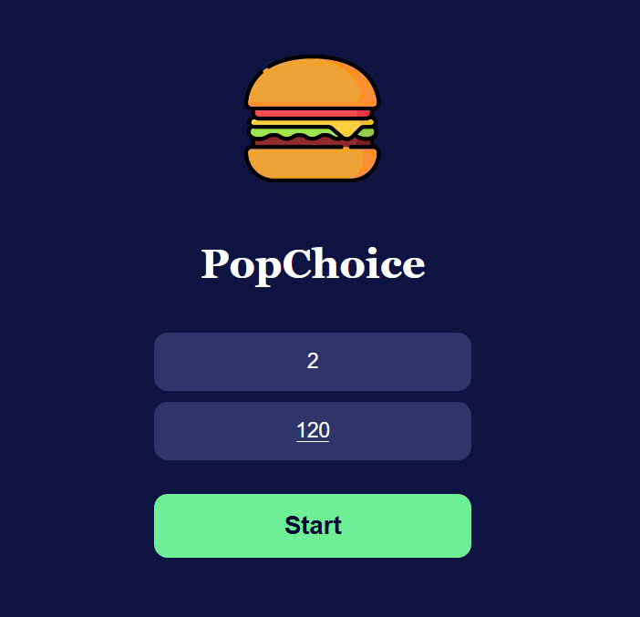
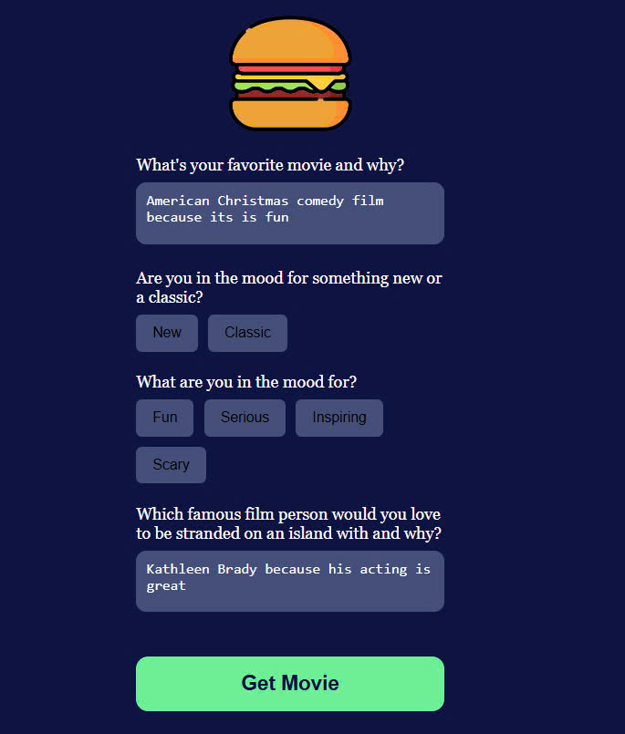

# 🌍 recommendation movie app

**recommendation movie app** is an RAG model integrated with OpenAI. The project consists of:

- **Backend**: Use OpenAI and Langchain to conduct recommendation movie chat.
- **Frontend**: A web interface built with React
- 
```

🔗 **Model Checkpoint:**  
[Download here](https://drive.google.com/file/d/1sTPV7wihk4b37Y6fpX454c05JiX1NP4T/view?usp=sharing)

---

## 🛠 Installation & Setup

### 1️⃣ Setting up **Backend**

#### Steps to set up the environment:

```sh
# Navigate to the backend directory
cd backend

# Open visual studio code
code .

# Open terminal and install required dependencies
npm i
```

---

### 2️⃣ Setting up **Frontend**

#### Steps to set up the environment:

```sh
# Navigate to the backend directory
cd frontend

# Open visual studio code
code .

# Open terminal and install required dependencies
npm i
```

---

## 🚀 Running the Application

### 🔥 Start Backend
```sh
# Navigate to the backend directory
cd backend

# Run the backend server
node server.js 
```

### 🎨 Start Frontend
```sh
# Navigate to the backend directory
cd frontend

# Run the backend server
npm start  
```

---

### 🖼️ Application UI

---

---

---
